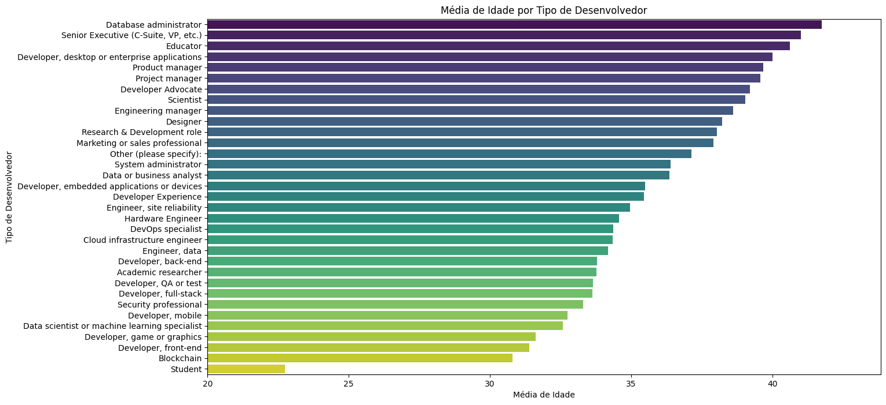
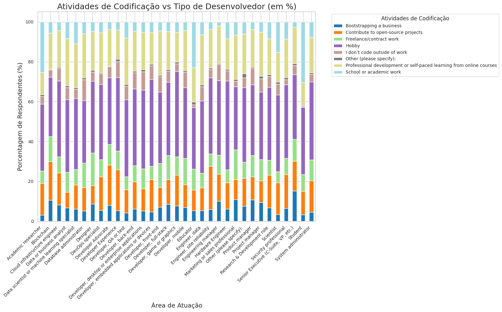

# Sobre o projeto.
Este projeto tem como objetivo apresentar os resultados da análise do Survey realizado pelo Stack Overflow em 2023. O survey é conduzido anualmente e visa compreender as preferências, desafios e experiências de desenvolvedores ao redor do mundo. Seus resultados fornecem insights valiosos para o setor de desenvolvimento de software.

Em 2023, mais de 90.000 desenvolvedores participaram da pesquisa, tornando essa uma das maiores amostras até o momento. No relatório a seguir, ficam apresentados os resultados obtidos por meio de análises como parte do processo de Business Intelligence. Essas análises ilustram como decisões estratégicas poderiam ser tomadas com base nesses dados.

# Relatório:
## Gráfico de Média de idade por Tipo de desenvolvedor

Este gráfico de barras horizontais representa a média de idade por tipo de desenvolvedor, destacando a distribuição etária média entre diferentes perfis de desenvolvedores. O gráfico evidencia que, na amostra, funções de maior senioridade tendem a ser ocupadas por profissionais de faixa etária mais elevada, o que pode refletir maior tempo de experiência e familiaridade com tecnologias consolidadas. Em contrapartida, funções mais técnicas ou em áreas emergentes, que atraem profissionais mais jovens, muitas vezes recém-formados ou ainda em formação, apresentam médias de idade mais baixas, indicando uma disposição maior para explorar e adotar novas tecnologias.  

Funções como Administrador de Banco de Dados, Executivos Seniores (C-Suite, VP, etc.), e Educadores possuem as médias de idade mais elevadas, todas acima de 35 anos. No outro extremo, funções como Desenvolvedor de Blockchain, Desenvolvedor de Front-end, e Estudante apresentam as menores médias de idade, abaixo de 30 anos.
A distribuição de idades sugere uma segmentação natural no mercado de trabalho de tecnologia. Para funções mais estratégicas e de liderança, as empresas podem precisar focar em profissionais mais experientes, o que muitas vezes requer programas de retenção de talentos e desenvolvimento de carreira para preservar essa experiência valiosa. No entanto, a diversidade etária dentro das equipes pode ser uma vantagem competitiva, combinando a experiência dos veteranos com a inovação dos mais jovens. Em áreas mais técnicas e emergentes, há uma oportunidade maior de atrair talentos jovens e inovadores, o que pode requerer programas de formação contínua e ambientes de trabalho que incentivem o aprendizado e o crescimento rápido.

## Gráfico de Popularidade das Linguagens de Programação

Este gráfico de barras verticais apresenta a popularidade de diversas linguagens de programação entre os entrevistados. JavaScript lidera com uma margem relativamente ampla, seguido por HTML/CSS e Python, linguagens essenciais no mercado de tecnologias web e desenvolvimento full-stack, refletindo sua destacada posição no mercado em geral.  
SQL, Java, e C# também aparecem em posições de destaque, evidenciando sua importância no desenvolvimento de sistemas para servidores, aplicações corporativas e manipulação de bancos de dados.  

Linguagens como Go, Rust, e Kotlin, que aparecem na metade da tabela, indicam tendências emergentes e nichos especializados. Por outro lado, linguagens com menor popularidade, como Julia, Erlang, e Raku, atendem a nichos específicos ou possuem uma base de usuários mais restrita, geralmente devido à sua aplicação em campos altamente especializados, projetos legados ou menor apelo à comunidade de desenvolvedores quanto ao seu diferencial tecnológico.

## Gráficos de Modalidade de Trabalho, Acentuando Trabalho Remoto.

  
O gráfico apresenta a distribuição das modalidades de trabalho (remoto, híbrido e presencial) em seis países. Cinco deles (Estados Unidos, Alemanha, Índia, Reino Unido e Canadá) foram escolhidos com base na quantidade de participantes na pesquisa, enquanto o sexto (Brasil) foi selecionado devido à sua relevância para esta análise. O Brasil se destaca pelo maior percentual de trabalho remoto (65,4%) entre os países analisados. Embora haja uma clara tendência de preferência pelo trabalho remoto e híbrido em vários países, refletindo mudanças significativas na forma como o trabalho é organizado globalmente, as implicações dessas mudanças são vastas, influenciando desde o design de políticas corporativas até a gestão de talentos e a necessidade de investir em tecnologias que suportem o trabalho distribuído..

## Divisão Salarial por Tipo de Desenvolvedor

Este gráfico ilustra a distribuição salarial e a média para diferentes tipos de desenvolvedores, utilizando valores em dólares americanos. Ele destaca as diferenças de remuneração entre as várias posições, refletindo as demandas e responsabilidades associadas a cada função. Observa-se uma valorização significativa das habilidades de liderança e gestão em comparação com funções voltadas para pesquisa e formação.  

No gráfico, todas as categorias, exceto “Marketing” e “Engenheiro de Hardware”, apresentam um ponto mínimo em zero. Isso pode indicar a ausência de desenvolvedores envolvidos em trabalho voluntário ou estágios não remunerados nessas áreas, sendo que, no caso do “Engenheiro de Hardware”, isso pode estar relacionado ao nível obrigatório de senioridade. A posição de “Executivo Sênior” exibe o maior limite superior de salário médio e o maior ponto médio, que é comparável, embora ligeiramente superior, ao ponto médio de “Gerente de Engenharia”. Ambas as posições envolvem liderança técnica na condução de projetos e gestão de equipes na indústria de tecnologia. Em contraste, funções acadêmicas de menor relevância, como estudante e pesquisador, apresentam as menores médias salariais, com o limite superior de “estudante” abaixo da média de todas as outras categorias.

## Atividades de Programação em Relação ao Tipo de Desenvolvedor

  
Este gráfico ilustra a relação entre as atividades de programação realizadas pelos desenvolvedores e suas ocupações. Observa-se que desenvolvedores vinculados ao meio acadêmico têm uma tendência significativa de programar para atividades escolares e trabalhos de pesquisa, o que é esperado devido às suas funções. Além disso, desenvolvedores de back-end e DevOps são os que mais contribuem para projetos open-source, indicando um forte envolvimento com a comunidade de desenvolvimento. Desenvolvedores de front-end e full-stack, por sua vez, tendem a codificar mais como hobby, sugerindo uma paixão pessoal pela programação além das demandas profissionais. Finalmente, engenheiros de dados e cientistas de dados dedicam uma parte significativa do seu tempo ao desenvolvimento profissional e ao aprendizado autodirigido, refletindo a necessidade de se manterem atualizados com novas tecnologias e metodologias.

